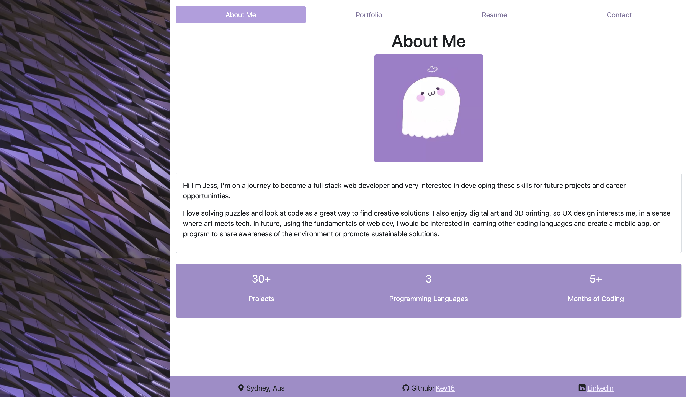

# React Portfolio


## Description

This portfolio is designed to use React and shows all of my past projects. It is uploaded live to heroku [here](https://jess-react-portfolio.herokuapp.com/)



## Table of Contents

- [Installation](#installation)
- [Usage](#usage)
- [Licenses](#licenses)
- [Contributing](#contributing)
- [Questions](#questions)

## Installation

Please run the following command line to install the neccesary packages

```
npm i && npm start
```

## Usage

How to use this code

Please install and start before running it in the server. Alternatively, you can access it from [here](https://jess-react-portfolio.herokuapp.com/).

## Licenses

This project is under the MIT License.

## Contributing

Contributions are what make the open source community such an amazing place to learn, inspire, and create.

Any contributions are welcome

## Questions

If you have any questions regarding this repository, you can contact me directly at jh.yield@gmail.com or find more of my work at [Key16](https://github.com/Key16)
